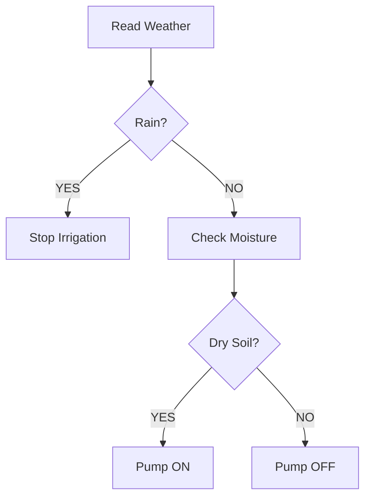
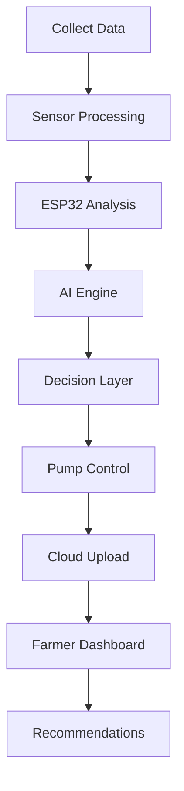

<div align="center">

# 🌾✨ AGRISENSE
### *AI Powered Precision Agriculture Ecosystem*


---

### 🚜 Transforming Traditional Farming into Intelligent Agriculture

*"From soil nutrients to crop intelligence, AgriSense brings the future of farming into the hands of farmers."*

🌱 Smart Soil Monitoring • 🌦 Weather Intelligence • 💧 Automated Irrigation • 📷 AI Pest Detection • 📊 Analytics Dashboard • 🤖 AI Assistant

</div>

---

# 📖 Table of Contents

- Overview
- Vision
- Problem Statement
- Solution Architecture
- Features
- Hardware Components
- Software Stack
- System Workflow
- AI Module
- Mobile Application
- Innovation Highlights
- Architecture Diagram
- Future Scope
- Market Opportunity
- SDG Alignment
- Project Impact
- Installation
- Team Vision
- License

---

# 🌍 Overview

Agriculture remains the backbone of many economies, yet a large portion of farming still depends on manual observation, traditional practices, and delayed decision-making.

Farmers frequently struggle with:

- Water wastage due to uncontrolled irrigation
- Soil degradation
- Improper fertilizer application
- Weather uncertainty
- Pest attacks
- Crop productivity issues
- Lack of digital accessibility

**AgriSense** is designed as a complete **AI + IoT precision agriculture ecosystem** that continuously monitors environmental conditions, analyses soil health, predicts agricultural needs, and automates farming operations.

Rather than functioning as a simple monitoring device, AgriSense acts as an intelligent farming assistant.

---

# 🎯 Project Vision

### Our Mission

To create an affordable and scalable agricultural intelligence platform capable of helping farmers maximize productivity while reducing resource consumption.

### Long Term Goal

Develop AgriSense into a complete agricultural ecosystem featuring:

🚁 Drone Surveillance

🛰 Satellite Monitoring

🤖 AI Disease Prediction

🌾 Autonomous Farm Robotics

🌍 Digital Twin Agriculture

---

# ⚠ Problem Statement

Modern farming faces multiple challenges:

| Problem | Impact |
|----------|---------|
| Excess irrigation | Water loss |
| Soil nutrient imbalance | Reduced yield |
| Lack of monitoring | Delayed action |
| Pest infestation | Crop damage |
| Climate uncertainty | Production loss |
| Manual inspection | Time consuming |

These issues directly affect:

📉 Crop production

📉 Resource efficiency

📉 Farmer income

📉 Sustainability

AgriSense addresses these through automation and intelligence.

---

# 💡 Solution Overview

AgriSense integrates:

```text
IoT Sensors
     ↓
Data Collection
     ↓
ESP32 Processing
     ↓
AI Analysis Engine
     ↓
Decision System
     ↓
Automation Layer
     ↓
Farmer Dashboard
```

The system continuously gathers field information and converts raw measurements into useful agricultural decisions.

---

# 🌱 Smart Soil Intelligence Node

The soil node acts as the foundation of AgriSense.

It performs complete soil analysis including:

### Parameters Measured

🌱 Soil Moisture

🧪 Soil pH

🧬 Nitrogen (N)

🧬 Phosphorus (P)

🧬 Potassium (K)

📊 Soil Fertility Status

---

## Sensors Used

```text
1. Soil Moisture Sensor
2. pH Sensor
3. 4-in-1 NPK Sensor
4. Analog Soil Inputs
```

---

### Soil Analytics Example

```yaml
Moisture: 32%

pH: 6.4

Nitrogen: LOW

Phosphorus: NORMAL

Potassium: HIGH

Recommendation:

→ Increase nitrogen fertilizer
→ Start irrigation
→ Suitable crops:
Rice
Potato
Tomato
```

---

# 🌦 Weather Monitoring Module

AgriSense continuously monitors environmental conditions.

### Weather Parameters

| Sensor | Function |
|---------|-----------|
| DHT11 | Temperature |
| DHT11 | Humidity |
| LDR | Sunlight Intensity |
| Rain Sensor | Rain Detection |

---

## Intelligent Weather Logic



---

# 💧 Smart Irrigation System

Traditional irrigation often causes:

❌ Overwatering

❌ Water wastage

❌ Uneven moisture distribution

AgriSense solves this using automated irrigation logic.

### Irrigation Features

✔ Sensor Based Watering

✔ Rain Aware System

✔ Soil Condition Analysis

✔ Day/Night Scheduling

✔ Moisture Threshold Detection

✔ Water Conservation

---

### Pump Decision Engine

```text
IF Soil Moisture < Threshold

      AND

Rain = FALSE

      THEN

Pump = ON

ELSE

Pump = OFF
```

---

# 📷 AI Pest & Bird Detection System

AgriSense integrates **ESP32-CAM** for intelligent crop surveillance.

### Detection Targets

🐦 Birds

🐛 Insects

🌾 Crop Damage

📸 Image Monitoring

⚠ Field Alerts

---

### Planned AI Expansion

- Disease Classification
- Leaf Health Detection
- Thermal Crop Analysis
- Pest Recognition
- Deep Learning Prediction
- Autonomous Countermeasures

---

# 📱 AgriSense Mobile Application

The AgriSense app provides farmers with real-time field insights.

---

### Dashboard Features

📈 Analytics Reports

🌡 Temperature Monitoring

🌱 Soil Reports

💧 Irrigation Status

📷 Pest Notifications

📊 Historical Data

🤖 AI Assistant

🌦 Weather Updates

---

### AI Assistant Example

```text
INPUT

Soil pH = 5.8

Moisture = LOW

Rain = FALSE

Nitrogen = LOW

OUTPUT

Recommended Action:

1. Start irrigation

2. Add nitrogen fertilizer

3. Maintain pH

4. Suitable Crop:
Rice
```

---

# 🧠 Artificial Intelligence Layer

AgriSense AI performs:

### Prediction Tasks

✔ Fertilizer Suggestions

✔ Crop Recommendation

✔ Irrigation Prediction

✔ Soil Analysis

✔ Weather Assistance

✔ Yield Optimization

✔ Future Disease Detection

---

# ⚙ Hardware Components

## Controller Units

```text
ESP32
ESP32-CAM
```

---

## Sensor Modules

```text
Soil Moisture Sensor

pH Sensor

NPK Sensor

DHT11

Rain Sensor

LDR Sensor
```

---

## Output Components

```text
Relay Module

Water Pump

OLED Display

LED Indicators

Buzzer

Power Module
```

---

# 🏗 System Architecture

```text

                    CLOUD SERVER

                           |

         +-------------------------------+

                AGRISENSE APP

      Analytics + Reports + AI Assistant

         +-------------------------------+

                           |

                      WiFi Module

                           |

==================================================

                    ESP32 MAIN UNIT

==================================================

        SOIL NODE              WEATHER NODE

 Moisture Sensor         Temperature

 pH Sensor               Humidity

 NPK Sensor              Rain Sensor

                         LDR Sensor

                \

                 \

            Decision Engine

                    |

            Relay Controller

                    |

             Water Pump

                    |

             Irrigation Layer

                    |

              ESP32-CAM AI

         Pest & Bird Detection

==================================================
```

---

# 🔄 System Workflow



---

# 🚀 Innovation Highlights

🌱 Multi Sensor Agriculture Platform

🤖 AI Driven Farming Assistant

📷 Vision Based Pest Monitoring

💧 Automated Irrigation

📊 Real Time Analytics

📱 Mobile Integration

🌦 Weather Intelligence

🧪 Soil Chemistry Monitoring

🛰 Future Expansion Ready

---

# 🌍 Sustainable Development Goals Alignment

AgriSense supports:

### SDG 2

Zero Hunger

### SDG 6

Clean Water & Sanitation

### SDG 9

Industry Innovation

### SDG 12

Responsible Consumption

### SDG 13

Climate Action

---

# 📈 Market Opportunity

Global Smart Agriculture Market:

### 2024

≈ $18 Billion

Expected Projection:

### 2032

≈ $45 Billion+

Major Drivers:

- Precision Farming
- AI Adoption
- Climate Change Solutions
- Water Conservation
- Food Security Demand

---

# 🔮 Future Scope

## Phase I

✔ Soil Monitoring

✔ Weather Node

✔ Irrigation

✔ Mobile Dashboard

---

## Phase II

🚁 Agricultural Drones

🌡 Thermal Cameras

🧠 AI Disease Detection

🛰 Satellite Support

---

## Phase III

🤖 Autonomous Farm Robots

🌾 Smart Fertilizer Dispensing

📈 Yield Prediction

🌍 Digital Twin Farming

☁ Cloud Intelligence

---

# 📊 Project Impact

Expected Improvements:

| Parameter | Improvement |
|-----------|-------------|
| Water Usage | ↓ 35% |
| Crop Monitoring Speed | ↑ 60% |
| Manual Work | ↓ 45% |
| Resource Optimization | ↑ 50% |
| Irrigation Accuracy | ↑ 70% |

---

# 👨‍💻 Team Vision

> Agriculture is evolving rapidly.

> AgriSense aims to bridge the gap between traditional farming and intelligent agriculture through affordable technology.

> We envision a future where every farmer has access to AI, automation, and precision monitoring.

---

# 🏆 Why AgriSense?

Because farming should not depend only on experience.

It should also benefit from:

🌱 Data

🤖 Intelligence

📷 Vision

💧 Automation

📈 Analytics

and innovation.

---

<div align="center">

# 🌾 AGRISENSE

### Smart Farming • Intelligent Decisions • Sustainable Future

*"Empowering Farmers Through Technology"*

Made with ❤️ by the AgriSense Team

</div>

---

# 📜 License

MIT License

Copyright © AgriSense Team

Permission granted for educational and research usage.
